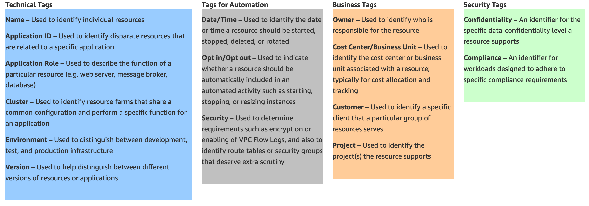

# Tagging Policy Research Notes

- Your tagging policy should be defined and enforced. If the tagging policy is not enforced, then it will unlikely add much value and will get a splintered standard, which is a much harder to manage end state.

- If you are storing multiple values in a tag, you need to define the structure at the start. This will ensure that everyone uses the same format. For example,

- Define a time format and use it consistently. The time format you define, should not be your own, use an industry one that has been tried and tested. For example UTC ISO8061, complete date plus hours, minutes and seconds: YYYY-MM-DDThh:mm:ssTZD (e.g. 1997–07–16T19:20:30+01:00). I like this one as it enables you to sort by the date quickly to find the most recent snapshots or backups.

- Using a buildID in the tag enables you to test multiple version of infrastructure code and quickly trace an environment back to its released code base.

- Data available through AWS APIs should not be duplicated in Tags.

- If the Name tag contains compounded fields, these fields should be available through other tags. e.g. if Name=’PROD-app101′ then there should be other fields for this information info:env=PROD and info:appId=101.

- _Tags should be (semi-) static information_ = Information that is frequently updated should not be stored in tags. e.g. CreatedBy could be tagged, but LastRebootedAt should not be.

### Security 
- AWS IAM Policies allow you to restrict access to resources based on tag values. For example, members of a certain department can only terminate EC2 instances owned by that department. Determine the types of segregation you need and be sure your tagging policy support it. This should be used to protect against accident operations, as malicious users could bypass.

### Possible Cost Reporting Strategies:
- There will likely be multiple levels of the organisation that require reports. e.g. the CIO may want a cost report broken down by department. Each department may want a cost report by project team.

 

### Use namespaces
Tags use colon-separated namespaces (e.g. AWS reserves the prefix ‘aws:’ for their own Tag Keys). You can use a prefix for tags specific to your organisation — ‘myorg:’. Generally, applicable tags can use a namespace like ‘info:’. Sub-namespaces can be reserved for use by departments in the organisation — ‘myorg:app:’ for application developer data.
- **NOTE:** It is important to check that your namespace is supported by all AWS resources. Some AWS resources have slightly different specifications.

## AWS Doc Notes:

- You can configure tags to be displayed with resources, and can search and filter by tag. By default, the AWS Management Console is organized by AWS service. However, the Resource Groups tool allows customers to create a custom console that organizes and consolidates AWS resources based on one or more tags or portions of tags. Using this tool, customers can consolidate and view data for applications that consist of multiple services, resources, and regions in one place.

- 

 
 

# Getting Started

## Requirements

**WHY:** 
- _Cost Reporting:_  categorise and attribute cost of service use (utilize AWS Cost Management tools + tagging)
- _Console Organization:_ maintain a standarized tagging strategy to better understand services structure across the org (Tags are a great way to organize AWS resources in the AWS Management Console)
- _Tracing/Filtering:_ allows for easy resource look up and filtering options

**WHO:** 
- Senior Leadership
- Dev Management
- Devops
- Individual devs

## General Best Practices

When creating a tagging strategy for AWS resources, make sure that it accurately represents organizationally relevant dimensions and adheres to the following tagging best practices:

- Always use a standardized, case-sensitive format for tags, and implement it consistently across all resource types.
- Consider tag dimensions that support the ability to manage resource access control, cost tracking, automation, and organization.
- Implement automated tools to help manage resource tags. The Resource Groups Tagging API enables programmatic control of tags, making it easier to automatically manage, search, and filter tags and resources. It also simplifies backups of tag data across all supported services with a single API call per AWS Region.
- Err on the side of using too many tags rather than too few tags.
- Remember that it is easy to modify tags to accommodate changing business requirements, however consider the ramifications of future changes, especially in relation to tag-based access control, automation, or upstream billing reports.

When identifying tagging requirements, focus on required and conditionally required tags. Allow for optional tags, as long as they conform toyour tag naming and governance policies, to empoweryour organization to define newtagsfor unforeseenor bespoke application requirements.

## Tagging Categories

Companies that are most effective in their use of tags typically create business-relevant tag groupings to organize their resources along technical, business, and security dimensions. Companies that use automated processes to manage their infrastructure also include additional, automation-specific tags to aid in their automation efforts.

## Common Tagging Strategies
The following sections describe common tagging strategies to help identify and manage AWS resources.

**Tags for Resource Organization:**

**Tags for Cost Allocation:**

**Tags for Automation:**

**Tags for Access Control:**

## Tagging Governance
An effective tagging strategy uses standardized tags and applies them consistently and programmatically across AWS resources. You can use both reactive and proactive approaches for governing tags in your AWS environment. 

- **Reactive governance:** is for finding resources that are not properly tagged using tools such as the Resource Groups Tagging API, AWS Config Rules, and custom scripts. To find resources manually, you can use Tag Editor and detailed billing reports. 
- **Proactive governance:** uses tools such as AWS CloudFormation, AWS Service Catalog, tag policies in AWS Organizations, or IAM resource-level permissions to ensure standardized tags are consistently applied at resource creation. 

For example, you can use the AWS CloudFormation `Resource Tags` property to apply tags to resource types. In AWS Service Catalog, you can add portfolio and product tags that are combined and applied to a product automatically when it is launched. More rigorous forms of proactive governance include automated tasks. For example, you can use the Resource Groups Tagging API to search an AWS environment’s tags, or run scripts to quarantine or delete improperly tagged resources. 

# NEXT STEPS:

NOTE: To ensure tags are useful identify an owner for each one. The tag ownerhas the responsibility to clearly articulate its value proposition. Having tagowners may help avoid unnecessary costs related to maintaining tags that are not used

1) First define Requirements for Tagging
2) Agree on mobile specific naming/tagging conventions
    - Sandbox, Develop, Prod discrepancies
3) 

 
